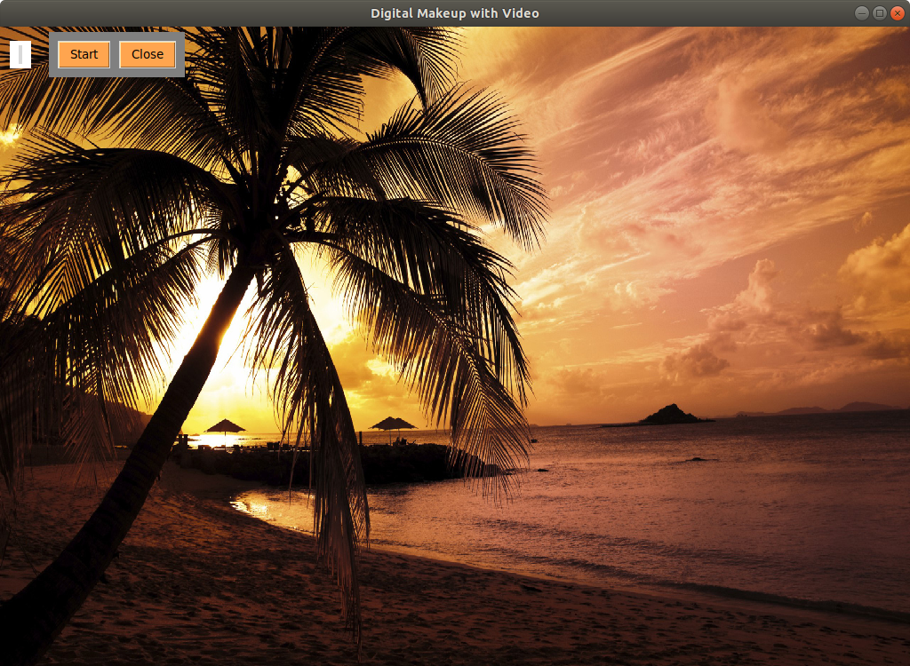

# Digital Face Makeup
17520960 - Đặng Quốc Quy\
17520967 - Đặng Hoàng Sang\
17521209 - Trần Vũ Hoàng Tú
# Requirement
- dlib
- opencv
- keras
- tkinter
- skimage
# Usage
_**python3 main.py**_\

1. Áp dụng trên **ảnh**
    * Chọn button `image`, một cửa sổ mới hiện ra như sau\
    
    * Chọn `Load Image` để mở một ảnh và makeup trên ảnh
        * Khi chọn `Load Image` sẽ có giao diện như sau\
        

        Tên | Chức năng
        --- | ---
        Lip | Dùng để tô môi bằng cách chọn các màu bên dưới
        EyeLiner | Dùng để kẻ eyeliner bằng cách chọn các màu bên dưới
        Hair | Dùng để đổi màu tóc bằng cách chọn các màu bên dưới
        EyeBrow | Dùng để tô chân mày bằng cách chọn các màu bên dưới
        DONE | Dùng để kết hợp nhiều tính năng bằng cách xác nhận 1 chức năng rồi xử dụng chức năng khác

    * Chọn `Close` để thoát
2. Áp dụng trên **video**
    * Chọn button `video`, một cửa sổ mới hiện ra như sau\
    
    * Chọn `Start` để bắt đầu\
        

        Tên | Chức năng
        --- | ---
        Lip | Dùng để tô môi bằng cách chọn các màu bên dưới
        EyeLiner | Dùng để kẻ eyeliner bằng cách chọn các màu bên dưới
        DONE | Dùng để kết hợp nhiều tính năng bằng cách xác nhận 1 chức năng rồi xử dụng chức năng khác
    * Chọn `Close` để thoát
3. `Our Team`\
    Giới thiệu tên đề tài, giáo viên hướng dẫn và nhóm thực hiện\
    
    * Chọn `Close` để thoát

4. `Quit`\
    Dùng để thoát chương trình
